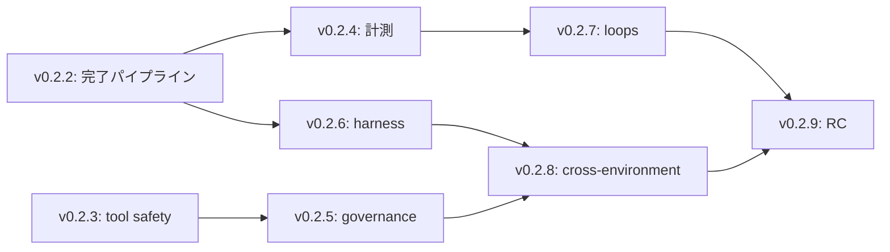

# v0.3 要件定義と v0.2 ロードマップ（ドラフト）

> Status: human inline review required
>
> Tracking: GitHub Issue #47

## 1. v0.3 の到達像

v0.3 は、Codex、Claude Code、hermes など実行環境が変わっても、複数の AI エージェントが GitHub を正として安全に並行開発し、再現可能な検証と継続的な改善を行えるフレームワークである。

利用者は、導入先の repository に AF を bootstrap した後、次を一貫して実行できる。

1. Issue の依存関係と承認境界を確認して、競合なく着手する。
2. 隔離環境で実装、検証、客観レビュー、PR、merge、Issue close を完了する。
3. 必須ツール、安全性、実利用検証を機械的に確認する。
4. 実行時間、トークン、品質結果を比較して、環境と運用を改善する。
5. トリガー起点の反復実行でも、人間承認と knowledge base の単一性を保つ。

## 2. 非目標

- 特定の Cloudflare 設定、DNS、公開サイト、名刺向けの訴求文面を AF 本体の機能にしない。
- 特定モデルや SaaS への固定的な依存を必須にしない。
- human approval が必要な auth、secret、billing、production deploy、法務・プライバシー判断を無人実行しない。
- 各導入先のアプリケーション固有の dev server、e2e、インフラを AF 自身が実装しない。AF は導入手順と品質境界を提供する。

## 3. 要件

| ID | 要件 | v0.3 で検証できる状態 |
|---|---|---|
| R1 | 完了パイプラインの信頼性 | 新規・既存 PR のどちらでも、GitHub 実状態を確認して review、merge、Issue close を正しく完了または安全に停止する。 |
| R2 | ツール実行の安全性 | profile の tool check は制限文法で評価され、任意 shell 評価をしない。 |
| R3 | 承認境界の強制 | human approval が必要なパスは CODEOWNERS と branch protection の設定手順で機械的に守れる。 |
| R4 | 再現可能な実行基盤 | 導入先が run / test / e2e / real-use gate / 隔離を設定するための harness 規約を bootstrap で受け取れる。 |
| R5 | 効果の可観測性 | Issue / PR / profile ごとに、secret を記録せずにトークン、時間、完了、品質、手戻りを比較できる。 |
| R6 | 最新情報の利用 | 必要なタスクで最新一次情報を参照する tool routing を選択できる。 |
| R7 | ループ運用の統制 | trigger 起点の反復実行が、1 repo 1 knowledge base と人間承認境界を崩さない。 |

## 4. 段階的リリース

| Version | 目的 | 対応 Issue | リリース判定 |
|---|---|---|---|
| v0.2.2 | 自律完了と人間確認の修復 | #40 | 既存 PR の merge / Issue close と、未解決の確認点だけを投稿する review request の shell 回帰テストが通る。 |
| v0.2.3 | tool gate の安全化 | #37 | `eval` を廃止し、全 profile の判定互換性と未知語彙の拒否を検証する。 |
| v0.2.4 | 効果計測の最小基盤 | #34 | privacy-safe な task 記録、集計コマンド、代表データのレポートを提供する。 |
| v0.2.5 | ガバナンスと最新情報 | #28, #29 | context7 の採否を根拠付きで決め、CODEOWNERS と branch protection の導入手順を配布する。 |
| v0.2.6 | 導入先 harness 規約 | #31 | run / test / e2e / isolation / real-use gate を導入先テンプレートで定義する。 |
| v0.2.7 | 承認付きループ運用 | #30 | trigger、knowledge base、toolchain の役割分担と approval boundary を決定する。 |
| v0.2.8 | 環境横断の採用検証 | 新規 Issue | Codex、Claude Code、hermes の少なくとも 2 環境で bootstrap から完了パイプラインまでを再現検証する。 |
| v0.2.9 | v0.3 release candidate | 新規 Issue | v0.3 要件 R1-R7 のトレーサビリティ、upgrade 手順、既知制約、release candidate の品質ゲートを確認する。 |

## 5. 既存 Issue の整理

| Issue | 扱い | 理由 |
|---|---|---|
| #40 | v0.2.2 | 現行の標準完了フローに実測済みの欠陥があり、human review のコメントも機械検査と混在している。以後の自動化の前提。 |
| #37 | v0.2.3 | tool gate の任意評価を除去する安全性修正。#40 と別ファイル中心だが、#40 完了後に実施する。 |
| #34 | v0.2.4 | 完了パイプラインと profile を観測対象として利用する。#40 完了後に計測の完了状態を信頼できる。 |
| #28, #29 | v0.2.5 | 既存の `v0.2.5` ラベルを維持する。tool routing と承認強制を同じ governance release で扱う。 |
| #31 | v0.2.6 | quality gate と templates に広く影響するため、前提を固めた後に導入する。 |
| #30 | v0.2.7 | harness、metrics、approval の設計を前提にする。実装より先に採否と境界を決める。 |
| #38 | バージョン対象外、needs-human 維持 | AF 本体ではない公開ページの訴求文面。人間承認後に別のプロダクト作業として扱う。 |

## 6. 追加する Issue の要件

### v0.2.8 環境横断採用検証

- What: 少なくとも 2 種の AI 環境で、bootstrap、tool gate、Issue-to-PR 完了パイプラインを実データを使わずに再現検証する。
- Why: profile 定義だけでなく、実際に環境差を越えて AF が動くことを v0.3 前に確認する。
- Done: 実行記録、差分、未対応環境、再現コマンドを残す。human approval を要する操作は実行しない。

### v0.2.9 v0.3 release candidate

- What: R1-R7 と実装 Issue の対応を監査し、upgrade、known limitations、release notes、品質ゲートを整える。
- Why: 個別機能の完了を、再利用できる一つのフレームワークとして出荷可能な状態へ統合する。
- Done: 要件トレーサビリティ、release checklist、公開 ZIP 検査、少なくとも 1 回の upgrade rehearsal が完了する。

## 7. 依存関係

## 8. レビューで決めること

1. v0.3 の到達像と R1-R7 は十分か。
2. v0.2.4 を v0.2.3 と分ける粒度は適切か。
3. v0.2.8 の対象環境を Codex / Claude Code / hermes のどれにするか。
4. v0.2.9 を RC とするか、v0.3.0 へ直接進めるか。
5. #38 を AF repository から分離する時期と追跡先。

## Sources

- [Issue #40](https://github.com/rytich/agentic-framework/issues/40)
- [Issue #37](https://github.com/rytich/agentic-framework/issues/37)
- [Issue #34](https://github.com/rytich/agentic-framework/issues/34)
- [Issue #28](https://github.com/rytich/agentic-framework/issues/28)
- [Issue #29](https://github.com/rytich/agentic-framework/issues/29)
- [Issue #31](https://github.com/rytich/agentic-framework/issues/31)
- [Issue #30](https://github.com/rytich/agentic-framework/issues/30)
- [Issue #38](https://github.com/rytich/agentic-framework/issues/38)
